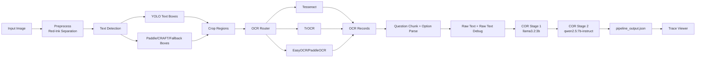
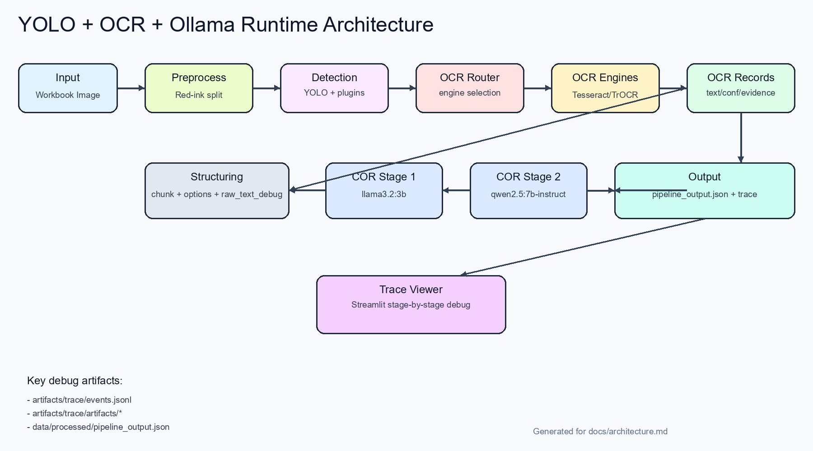

# OCR + YOLO + Ollama 아키텍처

이 문서는 현재 프로젝트의 실행 아키텍처를 **실제 코드 기준**으로 정리한 설계서다.

## 1) 전체 구성

- 입력: 문제집 사진 (`data/raw/*.jpg`)
- 추론 오케스트레이션: `src/infer/pipeline.py`
- 전처리: red-ink 분리/복원, 문자 단위 디버깅 (`src/infer/marker_processor.py`, `src/infer/char_analysis.py`)
- 검출: YOLO + 플러그인(Paddle/CRAFT) + fallback grid (`src/infer/text_detectors.py`)
- OCR: Router 기반 엔진 선택(Tesseract/EasyOCR/TrOCR/PaddleOCR) (`src/infer/ocr_router.py`, `src/infer/ocr_engine.py`)
- 구조화: 문항 chunk, option parse, raw_text_debug (`src/infer/pipeline.py`, `src/infer/option_parser.py`)
- COR(교정): Ollama 2-stage (`llama3.2:3b` -> `qwen2.5:7b-instruct`) (`src/infer/ocr_llama.py`)
- 관측: trace + Streamlit viewer (`src/vis/tracer.py`, `src/vis/viewer_streamlit.py`)

## 2) 실행 플로우 (Runtime)



## 3) 모듈별 책임

| 모듈 | 책임 | 입력 | 출력 |
|---|---|---|---|
| `pipeline.py` | 전체 orchestration | `configs/pipeline.yaml`, image path | 최종 JSON, trace events |
| `marker_processor.py` | red marker 분리/복원 | 원본 이미지 | text image, marker mask/layer |
| `text_detectors.py` | 플러그인 박스 검출 | 전처리 이미지 | text boxes + plugin errors |
| `ocr_router.py` | OCR 라우팅 정책 | region label/conf/lang hint | 사용할 OCR engine name |
| `ocr_engine.py` | 엔진 실행 + conf/evidence | crop image | `OcrResult` |
| `ocr_llama.py` | JSON 구조화 교정 | raw text + block payload | corrected JSON string |
| `viewer_streamlit.py` | 단계별 시각화 | trace 디렉토리 | 인터랙티브 디버깅 화면 |

## 4) 산출물 구조

- 최종 결과: `data/processed/pipeline_output.json`
  - `raw_text`
  - `raw_text_debug` (box별 품질/주범 박스)
  - `ocr_records`
  - `question_chunks`
  - `corrected` (LLM 최종 JSON)
- 추적 로그: `artifacts/trace/events.jsonl` + `artifacts/trace/artifacts/*`

## 5) 아키텍처 이미지

아래 PNG는 동일 구조를 한 눈에 보는 다이어그램이다.



## 6) 실행 명령

```bash
python -m src.infer.pipeline --config configs/pipeline.yaml
streamlit run src/vis/viewer_streamlit.py
```
